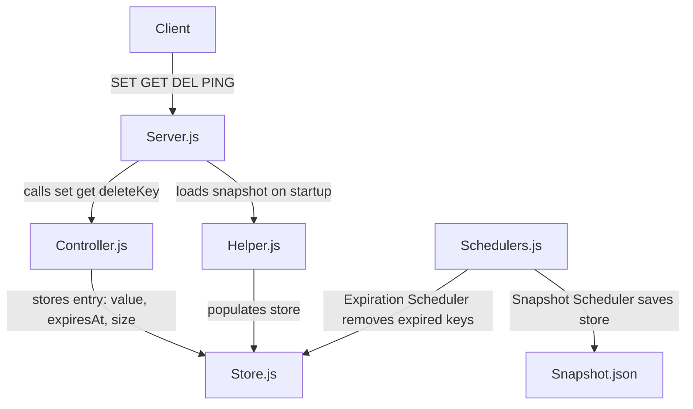

# Redis From Scratch
Had a bit of free time during the night, so I decided to built **Redis** from scratch.



Ever wondered how Redis works under the hood?
This is a learning experiment where I built a tiny, **Redis** inspired in-memory key-value store from scratch using pure **Node.js** with **zero dependencies.**

I mean, it's not meant for production, but it was a fun project and is perfect for exploring core Redis concepts such as:

- **SET / GET / DEL** – Basic key-value operations (currently supports strings only)
- **TTL (Time To Live)** – Setting expiration times for keys.
- **Lazy expiration** – Keys expire only when accessed.
- **Snapshots** – Persisting in-memory data to disk.
- **Background schedulers** – Handling asynchronous tasks.
- **Memory eviction** – Strategies for freeing up memory when limits are reached.

---


Everything is built **from scratch using Node.js**, just using native features like `Map`, `Buffer`, and `fs`. 

The server runs on localhost on port 6379 and you can run it easily by cloning the repository and running:

```bash
npm run start
```
---

## Architecture

The project is structured like this:

- **Server.js** → TCP server listens for commands (`SET`, `GET`, `DEL`, `PING`)  
- **Controller.js** → Handles logic for `set`, `get`, `deleteKey`, and memory accounting  
- **Store.js** → In-memory storage using `Map` + metadata (`CURRENT_STORE_SIZE`, `MAX_STORE_SIZE`)  
- **Helper.js** → Utility functions like `getSize()` and `loadSnapshot()`  
- **Schedulers.js** → Two schedulers:  
  - Expiration scheduler → removes expired keys  
  - Snapshot scheduler → saves current store to disk periodically  
- **Snapshot.json** → Persistent backup of the store in case of crash

